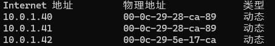
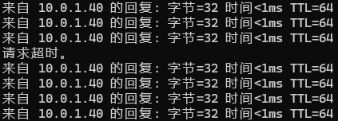
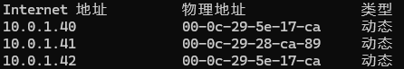

## HA工具安装

使用到的HA工具包括Keepalived和Consul，官网均提供二进制包下载。<br>
Keepalived <https://keepalived.org/download.html><br>
Consul <https://developer.hashicorp.com/consul/install#linux>

### Keepalived安装

- *安装Keepalived*

    登录到4台服务器，均执行命令安装Keepalived
    ```
    dnf install keepalived
    ```
    安装完成后检查keepalived软件包是否安装成功
    ```
    dnf list keepalived
    # 检查到类似如下安装结果
    Installed Packages
    keepalived.x86_64                                               2.1.5-9.el8                                               @media-appstream
    ```

- *配置Keepalived*

    Keepalived配置文件位于`/etc/keepalived/keepalived.conf`，其中已给出较多示例，根据实际部署情况修改配置文件，参考配置见<br>
    Master:[keepalived.conf](keepalived/Master/keepalived.conf)<br>
    Backup:[keepalived.conf](keepalived/Backup/keepalived.conf)<br>
    ```
    global_defs {                      # 全局参数
        router_id idname               # 此处指定路由器ID，需集群全局唯一
        vrrp_skip_check_adv_addr       # 检查VRRP通告内的所有IP地址可能比较耗时，设置此选项，如果接收到通告与上一条通告来自同一个master路由器，此通告将跳过检查
        vrrp_strict                    # 启用VRRP协议严格模式
        max_auto_priority              # 提高VRRP实例性能(线程实时优先级)
    }

    vrrp_instance VI_1 {               # VRRP实例(进程)VI_1
        state BACKUP                   # 可定义为MASTER或BACKUP
        interface ens160               # 虚拟IP绑定的接口
        virtual_router_id 40           # 虚拟路由器ID，同一个vrrp_instance中MASTER与BACKUP需一致
        priority 100                   # 该路由器的优先级，优先级高的作为MASTER                  
        nopreempt                      # 设定不抢占        
        advert_int 1                   # 检查间隔/心跳包发送周期，此处1s
        virtual_ipaddress {            # 虚拟IP地址
            xx.xx.xx.xx
        }
    }
    ```
    在示例中，Master与Backup的state均设定为**BACKUP**，并设定**nopreempt**，但Master的**priority**比Backup高。<br>
    当Master的状态异常导致Backup未能收到heartbeat包，Backup会自动升为MASTER并注册VIP地址，而后Master状态恢复，尽管其priority比Backup高，由于不抢占，Backup仍继续MASTER状态，避免因Master恢复导致网络/服务丢包。

    如果需要重新抢占，则Master的状态应该设定为MASTER，并去除nopreempt开启默认抢占。

- *Keepalived启动并检查*

    配置完成后，使用命令`systemctl start keepalived`启动服务，一段时间后使用`ip addr`应当可以看到在Master上绑定网卡多出设定虚拟IP地址，而Backup上无此地址。
    ```
    # Master
    [root@zbxs1 ~]# ip addr
    2: ens160: <BROADCAST,MULTICAST,UP,LOWER_UP> mtu 1500 qdisc fq_codel state UP group default qlen 1000
        ...
        inet 10.0.1.41/24 brd 10.0.1.255 scope global noprefixroute ens160
        valid_lft forever preferred_lft forever
        inet 10.0.1.40/32 scope global ens160
        valid_lft forever preferred_lft forever

    # Backup
    [root@zbxs2 ~]# ip addr
    2: ens160: <BROADCAST,MULTICAST,UP,LOWER_UP> mtu 1500 qdisc fq_codel state UP group default qlen 1000
        ...
        inet 10.0.1.42/24 brd 10.0.1.255 scope global noprefixroute ens160
        valid_lft forever preferred_lft forever
    ```
    使用命令`journalctl -u keepalived`也可查看到服务运行相关日志信息。

    此时
    
- *使用ping测试地址转移*

    我们可以使用一个可以连通此vrrp网络的终端使用ping工具测试连通性。

    在切换过程前，终端获取到Master/Backup与虚拟IP地址的MAC地址，查看arp应当可以看到虚拟IP地址(10.0.1.40)的MAC为Master(10.0.1.41)的MAC<br>
    <br>
    此时终端开启长ping，然后关闭Master的keepalived服务或是断开网卡网络连接，在Backup上应当查看到注册设定好的虚拟IP地址，即虚拟IP地址成功转移，终端ping会看到极少丢包后重新连通。<br>
    <br>
    停止长ping，再次查看arp，可以看到虚拟IP地址(10.0.1.40)的MAC变为Backup(10.0.1.42)的MAC
    <br>

### Consul安装

- *安装Consul*
    
    连接到Zabbix主/两台MySQL服务器，执行命令
    ```
    dnf config-manager --add-repo https://rpm.releases.hashicorp.com/RHEL/hashicorp.repo
    dnf install -y consul-1.22.2-1
    ```
    检查安装结果
    ```
    [root@zbxs1 ~]# dnf list installed consul*
    Installed Packages
    consul.x86_64                                               1.22.2-1                                               @hashicorp
    ```

- *配置Consul*

    打开`/etc/consul.d/consul.hcl`配置文件，找到并修改以下配置，参考配置见<br>
    Server:[consul:hcl](consul/server/consul.hcl)<br>
    Agent:[consul:hcl](consul/agent/consul.hcl)<br>
    ```
    # server端
    datacenter = "your dc name"     # 服务器所在集群名称，server/agent一致
    data_dir = "/opt/consul"           # consul运行时数据存放地，按需修改
    client_addr = "0.0.0.0"            # 绑定IP用于HTTP/DNS等连接consul，默认"0.0.0.0"全局监听
    log_level = "INFO"                 # 设定要记录的log等级为INFO
    log_file = "/var/log/consul/consul.log"   # 记录的log存放位置
    enable_local_script_checks = true  # 脚本检测仅在本地执行开启

    bind_addr = "10.0.1.41"            # 绑定IP用于集群内部通信，设定内网地址
    node_name = "consul-server"        # 本服务器的节点名，名称唯一

    ui_config{
        enabled = true                 # 开启内置webUI管理，建议Server开启，agent不启用
    }
    server = true                      # 指定此服务器server模式为开启
    bootstrap_expect=1                 # 指定server数量

    # agent端
    datacenter = "your dc name"
    data_dir = "/opt/consul"
    client_addr = "0.0.0.0"
    log_level = "INFO"
    log_file = "/var/log/consul/consul.log"
    enable_local_script_checks = true

    bind_addr = "10.0.1.51"
    node_name = "consul-agent1"

    ui_config{                         # 关闭UI管理，agent写false或整块直接注释
        enabled = false
    }
    server = false                     # 指定此服务器server模式为关闭，即agent模式
    retry_join = ["10.0.1.41"]         # 要加入集群联系server端地址，此参数值类型为数组
    ```
    设定好`log_file`，还应检查值对应路径是否存在和consul用户是否有权限，否则启动时会报错提示找不到日志文件。

- *启动Consul服务*

    配置完成后执行命令启动consul进程
    ```
    consul agent -config-dir=/etc/consul.d/
    ```
    若希望直接使用systemctl启动consul，则可以在` /etc/systemd/system/`下新建文件名为`consul.service`，内容示例如下
    ```
    [Unit]
    Description="HashiCorp Consul - A service mesh solution"
    Documentation=https://www.consul.io/
    Requires=network-online.target
    After=network-online.target
    ConditionFileNotEmpty=/etc/consul.d/consul.hcl

    [Service]
    EnvironmentFile=-/etc/consul.d/consul.env
    User=consul
    Group=consul
    ExecStart=/usr/bin/consul agent -config-dir=/etc/consul.d/
    ExecReload=/usr/bin/consul reload
    KillMode=process
    KillSignal=SIGTERM
    Restart=on-failure
    LimitNOFILE=65536

    [Install]
    WantedBy=multi-user.target
    ```
    此处要求启动consul进程的用户与组为consul:consul，使用命令`grep consul /etc/passwd`与`grep consul /etc/group`检查是否已被创建，如无则应创建名为consul的组及用户，并将consul设定为/bin/false控制bash权限。确认无误即可systemctl启动。

    启动后，浏览器访问`http://server_ip:8500/`，点击左侧Nodes选项卡查看所有节点都已连接，命令行则输入`consul members`查看节点信息。
