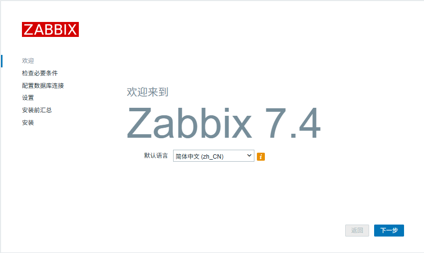
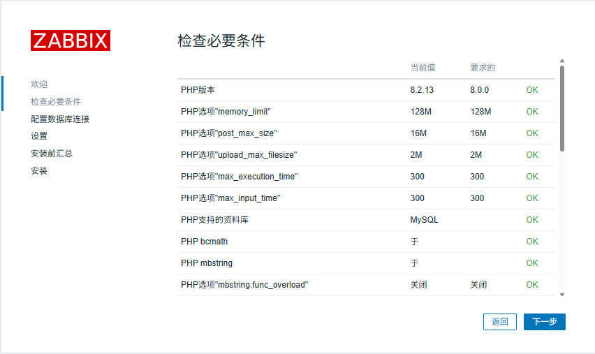
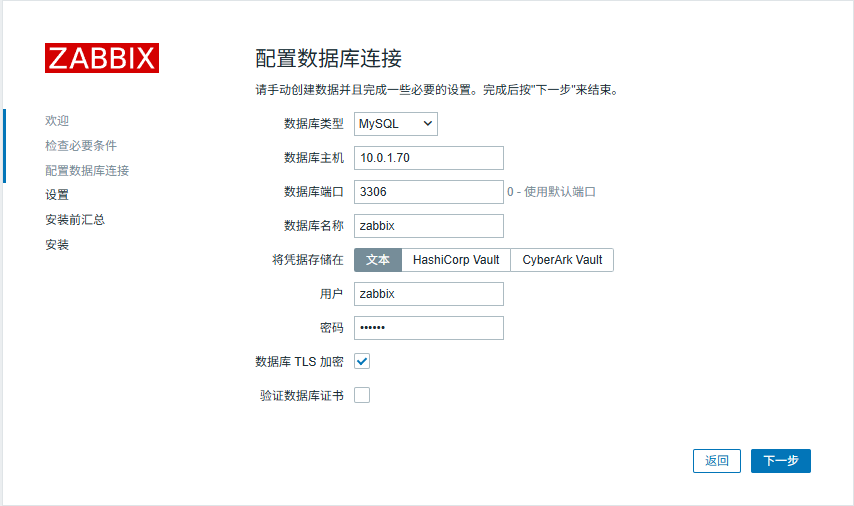
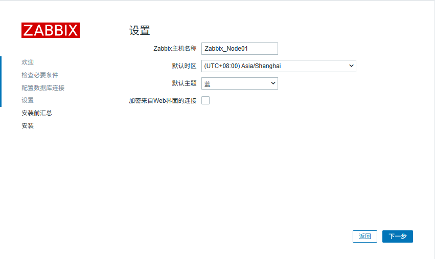
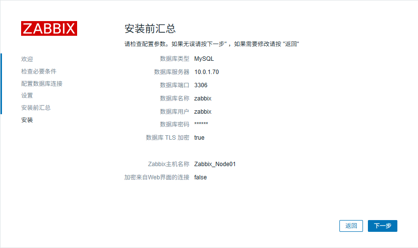
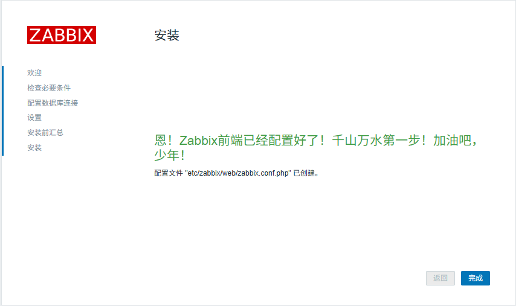

## Zabbix配置

前文我们已经安装过Zabbix的组件，现在需要创建和导入Zabbix的数据库用户/表结构等数据

- *Zabbix的MySQL数据库配置*

    登录到MySQL数据库，运行以下代码，其中<br>
    1. 用户zabbix的ip范围应更改为你自己的zabbix所在网段或所在ip，使得你的zabbix-server能够访问数据库，此处写为10.0.1.X网段。
    2. 用户zabbix按照在`zabbix_server.conf`中`DBPassword`项设定值填写，前文设定值为zabbix。
    ```
    mysql> create database zabbix character set utf8mb4 collate utf8mb4_bin;
    mysql> create user 'zabbix'@'10.0.1.%' identified by 'zabbix';
    mysql> grant all privileges on zabbix.* to 'zabbix'@'10.0.1.%';
    mysql> set global log_bin_trust_function_creators = 1;
    ```

    登录到Zabbix服务器，找到zabbix数据库导入脚本，将脚本压缩包传到MySQL服务器（存放地址无要求），并在MySQL服务器上执行导入脚本
    ```
    # Zabbix上
    scp -p /usr/share/zabbix/sql-scripts/mysql/server.sql.gz root@10.0.1.50:/root/

    # MySQL上
    zcat server.sql.gz | mysql --default-character-set=utf8mb4 -uzabbix -p zabbix
    Enter password:               # 此处输入MySQL用户zabbix的密码
    ```
    执行结束后登录MySQL源副本库查看是否均有zabbix库，如数据库复制正常工作，则在副本库上应当看到我们在主库执行插入的数据均已被同步
    ```
    mysql> SHOW DATABASES;
    +--------------------+
    | Database           |
    +--------------------+
    | information_schema |
    | mysql              |
    | performance_schema |
    | sys                |
    | zabbix             |
    +--------------------+
    5 rows in set (0.08 sec)
    ```
    最后关闭在导入过程中开启的`log_bin_trust_function_creators`变量
    ```
    mysql> set global log_bin_trust_function_creators = 0;
    mysql> quit;
    ```

- *开启并配置Zabbix*

    启动Zabbix server和agent进程，并设定开机自启
    ```
    systemctl start zabbix-server zabbix-agent nginx php-fpm
    systemctl enable zabbix-server zabbix-agent nginx php-fpm
    ```

    浏览器访问Zabbix地址`http://your_ip:port`，端口为在nginx配置中设定值，以下为安装过程示例

    注意：主备都应进入Zabbix安装页面进行安装

    1. 欢迎

        

    2. 检查必备条件

        检查php等与zabbix运行相关的模块设定参数，有不通过需要对应检查
        

    3. 配置数据库连接

        MySQL插件`caching_sha2_password`要求安全连接，此处需要勾选数据库TLS加密，其他根据网络情况填写
        

    4. 基本设置

        

    5. 安装前汇总

        最后检查参数是否正确
        

    6. 结束

        

    完成后输入用户名密码登录，默认用户名密码为<br>
    用户名：Admin<br>
    密码：zabbix

    Zabbix高可用到 仪表盘--系统信息 内查看<br>
    <br>
    同时也可使用命令行执行`zabbix_server -R ha_status`查看HA状态
    ```
    [root@zms ~]# zabbix_server -R ha_status
    Failover delay: 60 seconds
    Cluster status:
    #  ID                        Name                      Address                        Status      Last Access
    1. cmndrzqzk0001dhap0hrqcxez Zabbix_Node01             10.0.1.41:10051                active      5s
    2. cmndsyes70001d8ae97mrk0mr Zabbix_Node02             10.0.1.42:10051                standby     11s
   ```