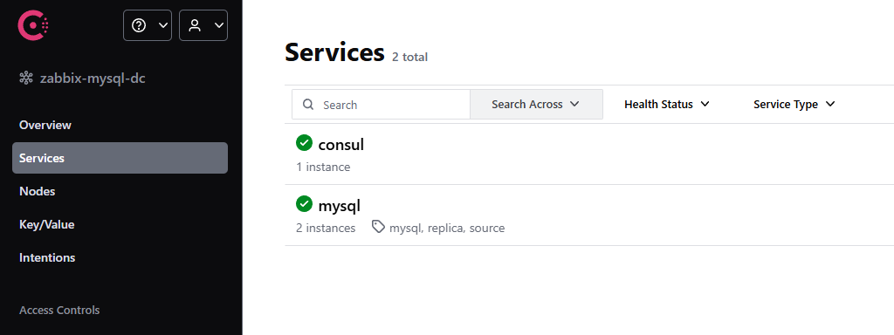
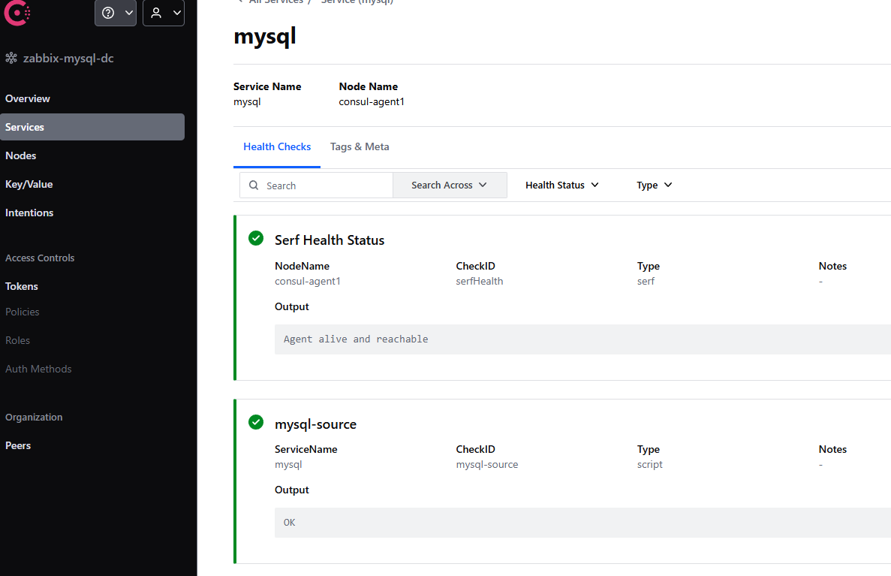

## 故障转移部署
此处故障转移的实现基本思路如下：

**Zabbix**：<br>
Zabbix的自我配置HA中，主节点Active会启动server监听端口（默认10051），而备节点Standby不启动监听端口，则keepalived监听两个节点的端口连通性即可判断主备情况执行虚拟IP转移。

**MySQL**：<br>
MySQL的源副本复制在源节点故障时并不会自动切换，使用crontab定时执行MySQL健康检查脚本，在文件中周期记录健康状态供Consul与Keepalived使用，Consul agent使用check执行脚本监听记录的健康状态并上报Consul server，Consul server使用watch监测check状态变化实现源副本故障转移，Keepalived监听记录的健康状态同步执行虚拟IP转移。

### 部署前准备
首先在两台MySQL服务器上部署健康检查脚本，注意使用`chmod`添加脚本执行权限。以下示例如何检查MySQL进程存在与副本复制状态。
```
LOCAL_IP="10.0.1.51"
MYSQL_USER="mysql_check"
MYSQL_PWD="123456"
MYSQL_PORT="3306"
CHECK_RESULT_FILE="/tmp/mysql_health.status"

# 检测MySQL进程是否存活
if [ -z $(pgrep "mysqld") ]; then
    echo "DOWN" > $CHECK_RESULT_FILE
    exit 1
fi


# 从库：检测复制线程是否正常
REPL_IO=$(mysql -h $LOCAL_IP -u$MYSQL_USER -p$MYSQL_PWD -e "SHOW REPLICA STATUS\G" | grep 'Replica_IO_Running:' | awk '{print $2}')
REPL_SQL=$(mysql -h $LOCAL_IP -u$MYSQL_USER -p$MYSQL_PWD -e "SHOW REPLICA STATUS\G" | grep 'Replica_SQL_Running:' | awk '{print $2}')
if [ "$REPL_IO" != "Yes" ] || [ "$REPL_SQL" != "Yes" ]; then
    echo "DOWN" > $CHECK_RESULT_FILE
    exit 1
fi
```
完整检查脚本详见<br>
Source:[mysql_check_health.sh](shell/source/mysql_check_health.sh)<br>
Replica:[mysql_check_health.sh](shell/replica/mysql_check_health.sh)

执行`crontab -e`安装脚本执行的定时任务，以下任务示例每10秒执行一次脚本
```
*/5 * * * * /home/consul/mysql_check/mysql_check_health.sh
* * * * * sleep 10 && /home/consul/mysql_check/mysql_check_health.sh
* * * * * sleep 20 && /home/consul/mysql_check/mysql_check_health.sh
* * * * * sleep 30 && /home/consul/mysql_check/mysql_check_health.sh
* * * * * sleep 40 && /home/consul/mysql_check/mysql_check_health.sh
* * * * * sleep 50 && /home/consul/mysql_check/mysql_check_health.sh
```
定时任务安装后，检查`mysql_health.status`文件及内容，确认脚本运行符合预期。


### Consul故障转移脚本部署

- *Consul check部署*

    在两台MySQL服务器上部署用于Consul的状态检查脚本，注意使用`chmod`添加脚本执行权限。脚本内容为读取status文件内容返回状态，示例如下
    ```
    status_file_dir="/tmp/mysql_health.status"

    if test -f $status_file_dir ; then
        isup=$(cat $status_file_dir | grep -c UP)
        if [ "$isup" -gt 0 ] ; then
            echo "OK"
            exit 0
        else
        echo "FAIL"
            exit 2        # 为设定DOWN返回到Consul为Critical状态
        fi
    else
        echo "FAIL"
        exit 2
    fi
    ```
    脚本详见<br>
    Source:[mysql_check_status.sh](shell/source/mysql_check_status.sh)<br>
    Replica:[mysql_check_status.sh](shell/replica/mysql_check_status.sh)

    然后为Consul添加check配置文件，在consul配置文件路径中新建配置文件，写入内容如下
    ```
    # source_mysql_check.json
    {
        "service":
        {
            "name": "mysql",
            "address": "10.0.1.50",
            "port": 3306,
            "tags": ["mysql", "source"],
            "check": {
                "id": "mysql-source",
                "name": "mysql-source",
                "args":["/bin/sh","-c","/home/consul/mysql_check/mysql_check_status.sh"],
                "interval": "10s",
                "timeout": "5s"
            }
        }
    }

    # replica_mysql_check.json
    {
        "service":
        {
            "name": "mysql",
            "address": "10.0.1.52",
            "port": 3306,
            "tags": ["mysql", "replica"],
            "check":{
                "id": "mysql-replica",
                "name": "mysql-replica",
                "args":["/bin/sh","-c","/home/consul/mysql_check/mysql_check_status.sh"],
                "interval": "10s",
                "timeout": "5s"
            }
        }
    }
    ```
    配置详见<br>
    Source:[source_mysql_check.json](consul/agent/source_mysql_check.json)<br>
    Replica:[replica_mysql_check.json](consul/agent/replica_mysql_check.json)

    写入后使用命令`consul reload`或`systemctl restart consul`重启consul，访问server web的services<br>
    <br>
    点击mysql service并查看详细确认agent check是否正常执行。<br>
    

- *Consul watch部署*

    在Consul server服务器上部署用于Consul执行MySQL的故障切换脚本，注意使用`chmod`添加脚本执行权限。脚本内容为根据check返回状态执行故障切换，示例如下
    ```
    # 如果执行出现错误立即停止脚本执行，避免误切换或切换过程出问题导致数据丢失
    set -u       

    ...
    # watch返回的值由数组包裹，故使用jq工具先去除外层数组
    INPUT=$( cat | jq '.[]')   

    ...

    # 根据check的上报值确认源副本服务状态
    SOURCE_ALIVE=$(echo "$INPUT" | jq --arg id "$SOURCE_CHECK_ID" '. | select(.CheckID == $id) | .Status == "passing"')
    REPLICA_ALIVE=$(echo "$INPUT" | jq --arg id "$REPLICA_CHECK_ID" '. | select(.CheckID == $id) | .Status == "passing"')

    if [ "$SOURCE_ALIVE" = "false" ] && [ "$REPLICA_ALIVE" = "true" ]; then
    # 此处应当确认副本是否已经执行完毕所有的数据写入事务，执行重置复制指令会导致所有正在执行中的数据写入会丢失
    REPLICA_STATUS_NOW=$( $SSH_PATH $MYSQL_REPLICA_ADDR "
        mysql -u$MYSQL_SWITCH_USER -p$MYSQL_SWITCH_PASS -e '
        SHOW REPLICA STATUS\G;
        '
    " | grep "Replica_SQL_Running_State:" | awk -F : '{print $2}' )
    if echo "$REPLICA_STATUS_NOW" | grep -q "has read all relay log" || echo "$REPLICA_STATUS_NOW" | grep -q "waiting for more updates"; then
        # 停止重置复制后还应该关闭副本只读，否则副本启用后无法写入数据
        $SSH_PATH $MYSQL_REPLICA_ADDR "
        mysql -u$MYSQL_SWITCH_USER -p$MYSQL_SWITCH_PASS -e '
            STOP REPLICA;
            RESET BINARY LOG AND GTIDS;
            SET GLOBAL read_only=OFF;
            SET GLOBAL super_read_only=OFF;
        '
        "
    ...
    ```
    脚本详见[mysql_failover.sh](shell/master/mysql_failover.sh)

    然后为Consul添加watch配置文件，在consul配置文件路径中新建配置文件，写入内容如下
    ```
    {
        "watches": [
            {
                "type": "checks",
                "service": "mysql",
                "handler_type": "script",
                "args": ["/bin/sh", "-c", "/home/consul/mysql_check/mysql_failover.sh"]
            }
        ]
    }
    ```
    写入后使用命令`consul reload`或`systemctl restart consul`重启consul。当watch探测到mysql服务下的两个check出现状态变化时，则会自动执行failover脚本，自动完成故障转移。

### Keepalived监测部署

- *MySQL监测*

    在两台MySQL服务器上部署用于keepalived的状态检查脚本，注意使用`chmod`添加脚本执行权限。脚本内容为读取status文件内容返回状态，示例如下
    ```
    CHECK_RESULT_FILE="/tmp/mysql_health.status"

    if [ ! -f $CHECK_RESULT_FILE ]; then
        exit 1
    fi

    RESULT=$(cat $CHECK_RESULT_FILE)
    if [ "$RESULT" == "UP" ]; then
        exit 0
    else
        exit 1
    fi
    ```
    脚本详见<br>
    Source:[mysql_check_keepalived.sh](shell/source/mysql_check_keepalived.sh)<br>
    Replica:[mysql_check_keepalived.sh](shell/replica/mysql_check_keepalived.sh)

    然后为keepalived配置文件增加脚本切换，配置`vrrp_script`块，示例如下
    ```
    vrrp_script check_mysql {
        script "/home/consul/mysql_check_keepalived.sh"
        interval 2
        weight -20
    }
    ```
    脚本执行周期设定为2秒，当脚本退出状态为1，即检测到错误，则对应优先级减少20，执行虚拟IP切换。

    配置详见<br>
    Source:[keepalived.conf](keepalived/source/keepalived.conf)<br>
    Replica:[keepalived.conf](keepalived/replica/keepalived.conf)

- *Zabbix Server监测*

    在两台Zabbix服务器上部署用于keepalived的状态检查脚本，注意使用`chmod`添加脚本执行权限。脚本内容为检测网络监听端口是否存在Zabbix Server的监听端口，示例如下
    ```
    ZABBIX_SERVER_PORT=10051
    PORT_LISTS="netstat -tnlp | grep $ZABBIX_SERVER_PORT | wc -l"

    if [ "$PORT_LISTS" -gt 0 ]; then
        exit 0
    else
        exit 1
    fi
    ```
    脚本详见<br>
    Master:[zabbix_check_keepalived.sh](shell/master/zabbix_check_keepalived.sh)<br>
    Backup:[zabbix_check_keepalived.sh](shell/backup/zabbix_check_keepalived.sh)

    然后为keepalived配置文件增加脚本切换，配置`vrrp_script`块，示例如下
    ```
    vrrp_script check_port {
        script "/root/zabbix_check_keepalived.sh"
        interval 2
        weight -20
    }
    ```
    脚本执行周期设定为2秒，当脚本退出状态为1，即检测到错误，则对应优先级减少20，执行虚拟IP切换。

    配置详见<br>
    Master:[keepalived.conf](keepalived/master/keepalived.conf)<br>
    Backup:[keepalived.conf](keepalived/backup/keepalived.conf)

至此，全部架构已部署完毕。